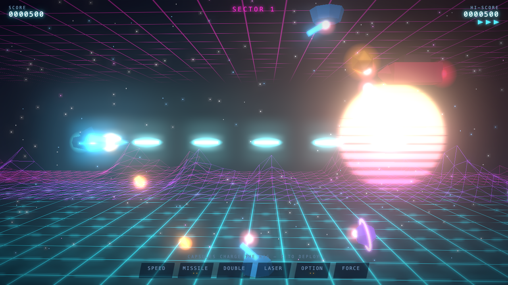

# ION TEMPEST

*Ride the storm — shoot the core.*

A neon-synthwave 3D side-scrolling shooter in the spirit of Gradius, built with
[Three.js](https://threejs.org/). Pure client-side static site — open
`index.html` and fly. Works from `file://` or any nested subdirectory (the
bundle is a single relative-path IIFE).



## Controls

| Input | Action |
| --- | --- |
| **WASD / Arrows** | Steer |
| **Space / Z / J** | Fire (hold for autofire) |
| **X / Shift / Enter / K** | Deploy charged power |
| **P / Esc** | Pause |
| **M** | Toggle sound |

## The power rig

Destroy the pulsing **amber carriers** to harvest ion capsules. Each capsule
advances the rig cursor one cell — deploy when it's on the upgrade you want:

`SPEED · MISSILE · DOUBLE · LASER · OPTION · FORCE`

- **SPEED** — engine boost (stacks ×4)
- **MISSILE** — floor-crawling missiles (stacks ×2)
- **DOUBLE** — adds a 45° upward shot (exclusive with laser)
- **LASER** — piercing beam (stacks ×2, exclusive with double)
- **OPTION** — trailing drone that mirrors your fire (stacks ×3)
- **FORCE** — 4-hit energy shield (re-deploy to refresh)

Deploying on a maxed cell converts the charge to points. Kill chains build a
score multiplier (up to ×5). Every 5th sector, a Dreadnought blocks the way —
break the shell, then shoot the core. Dying costs your rig, but a couple of
pity capsules drift in with the respawn.

Sound is 100% procedural WebAudio (no assets) — synth SFX plus a generative
synthwave loop that shifts darker during boss fights.

## Development

```
npm install          # three + esbuild (+ playwright for tests)
npm run build        # bundle src/ -> assets/game.js
npm run dev          # watch mode
npm test             # headless Playwright smoke + systems tests
```

The deployed artifact is just `index.html` + `assets/game.js` — everything
else is source and tooling.
